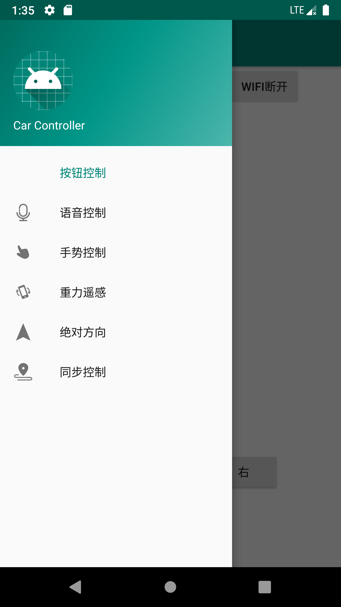
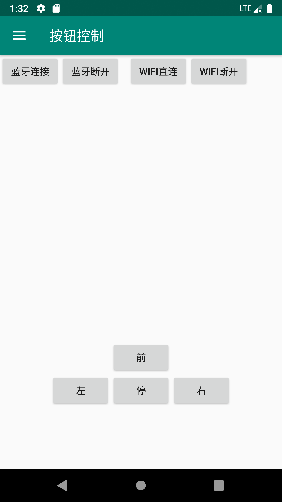
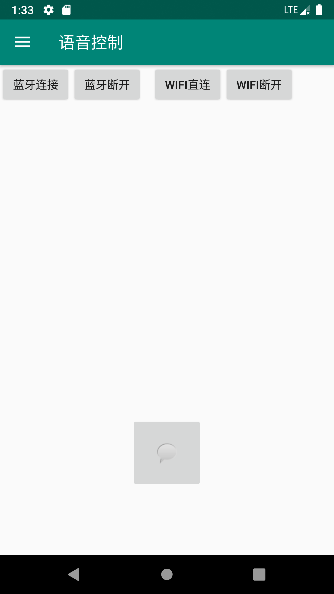
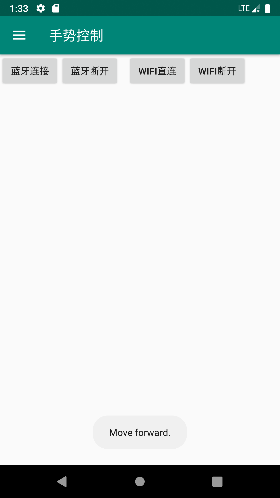
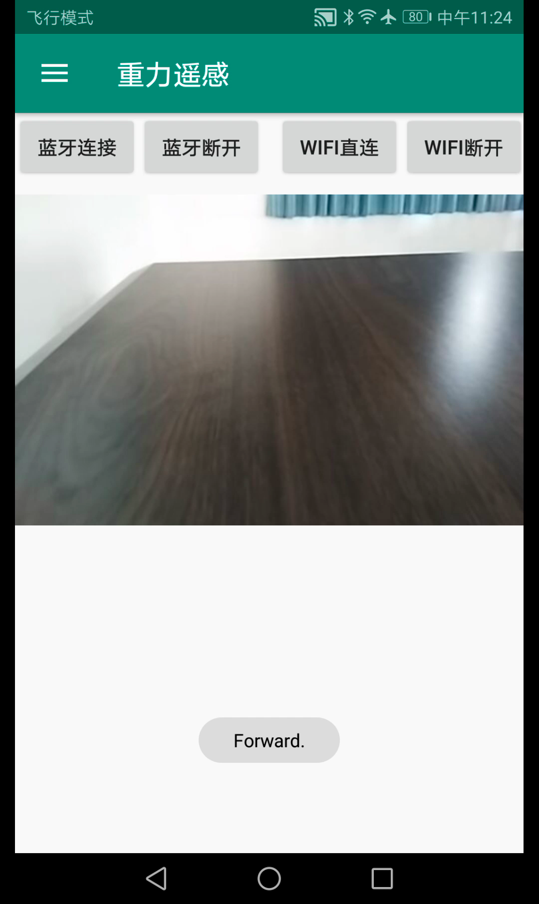
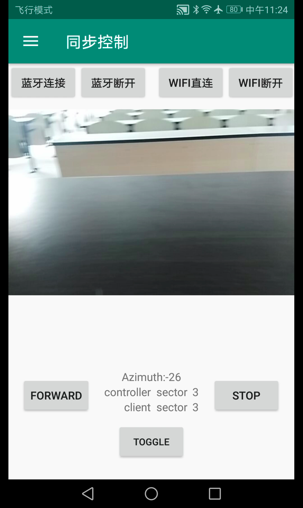
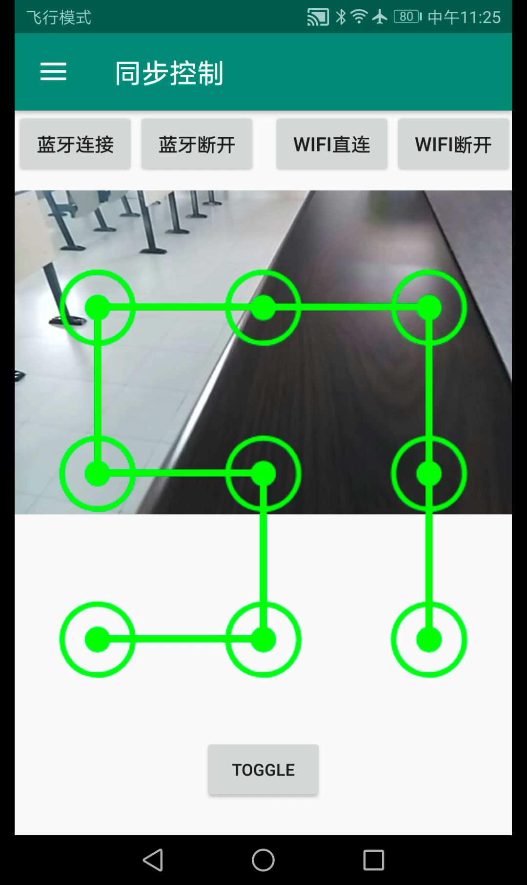

# SJTU-EI312
Car control on Android
## Architecture Overview
Our project consists of three major modules: 

1. CarClient. It is supposed to be installed on the phone placed on the car. Its function includes:
	1. Data transmission.
	2. Camera preview.
	3. System sensors.
	4. Auto light.
2. CarController. It is supposed to be installed on a phone other than that with CarClient installed. Its function includes:
	1. Signal transmission.
	2. Data reception.
	3. Main control.
3. Car. Its function is to move according to the received signal.

## Software
### Control Panel
In the four figures below, the leftmost one is the navigation bar of our app. The user can navigate to any of our control method through it.

    

#### Basic Control
Second from the left (above) is the basic button control. The signals correspond to the text on the buttons.
#### Speech Control
Second from right (above) is the speech control. Hold the button during speaking and release it after finishing. It recognizes the speech through keywords like "前/直，停，左，右" (forward, stop, left, right) and duration for the control to execute before a stop through "秒" (second(s)), e.g. "前进"，"左转3秒".
#### Gesture Control
The rightmost (above) figure is the gesture control. The user can slide on the screen to generate control signals. The Toast below shows the signal corresponding to the gesture. A mapping from gesture to control signal is *up -> forward, down -> stop, left -> left, right -> right*.
#### Gravity Control
The leftmost (below) figure is the gravity control. The Toast below shows the signal corresponding to the current phone placement. The phone is suppose to be horizontal with screen facing the user, top to the left and relatively upright (in this context, this placement is called base placement) and auto-rotate shut off. The placement-signal mapping is (all comparing to base placement) *move top edge away from user -> forward, base placement -> stop, rotate the phone clockwise -> right, rotate the phone counter-clockwise -> left*
#### Absolute Control
The second from left (below) is the absolute control. The car will move in the direction (north, south, east, west, stop) the user designates. The current direction TextView indicates the direction of the **CarClient** and the relative signal TextView indicates the control signal considering the current direction and the most recent pressed button.
#### Synchronous Control
The second from the right (below) is the basic synchronous control. The car consistently tries to face the direction the controller phone faces. The controller phone is supposed to be horizontal with screen facing the user, top to the left. The TextViews are debug informations. **FORWARD/STOP** button indicates whether the car forwards or stops when its direction is in consistency with that of the controller. **TOGGLE** flips the UI between basic synchronous control and sudoku control.

The rightmost (below) is the sudoku control. The user can draw any valid patterns in the sudoku and the car moves in the same trace. After the car finishes the trajectory, it stays synchronized with the controller. The placement of controller is the same as that of basic synchronous control.

    

## Project Structure
### `DirectionSensor` Module
This module implements `SensorEventListener` and is used in absolute, synchronous control in CarController and main activity in CarClient. In `onSensorChanged` method, first use the values of accelerometer and magnetic field sensors to get the orientation including azimuth, pitch and roll (see detailed information in android [doc](https://developer.android.com/reference/android/hardware/SensorManager.html#getOrientation(float[],%20float[]))), then followed by an abstract method `processDataOrSendSignal` for other specific logic on instantiating. In addition, the class provides `registerSensors` and `unregisterSensor` methods to control the usage of sensors in order to save power when it is not needed.

### `CarClient.LightSensor` Module
This module implements `SensorEventListener` and is used in main activity in CarClient. In `onSensorChanged` method, it checks the ambient illuminance and whether light is on and call abstract methods `lightOn`/`lightOff` according to the situation. These two methods ought to be abstracted because the `CameraPreview` module occupies the camera all the time and others cannot control the flashlight, thus the logic of turning on/off light has to be implemented by the `CameraPreview` module. Likewise, this class has `registerSensor` and `unregisterSensor` methods.

### `CarClient.MainActivity`
There are four buttons on the layout. One for WiFi Direct connect, one for WiFi Direct disconnect, one for turning on/off direction sensor and one for turning on light sensor. Next to the sensor switch buttons are their status, i.e. on/off along with the values if the sensor is on. Below is the view of the camera.

### `CarController.GestureFragment`
The logic is implemented in a `gesture_detector` which is an instance of `GestureDetector` with `onFling` method overridden. First define a `LEAST_DISLACEMENT`, any gesture whose displacements on both axis smaller than this value is considered invalid. Then compare the absolute displacement on two axis and determine it is a horizontal or a vertical move. At last, determine the sign of displacement on the major axis to figure out the actual gesture.

### `CarController.GravityFragemnt`
Use a `direction_sensor` which is an instance of `DirectionSensor` to get the orientation, in particular pitch and roll of the device, interpret the current placement and send signal accordingly.

### `CarController.AbsoluteFragment`
Use an `onOrientationArrive` which is an instance of `BroadcastReceiver` to get the azimuth of the **CarClient** and compute the angle between the current client direction and user designated direction (north, south, east, west) and send turning signal until the two directions meet.

### `CarController.SynchronousFragment`
Use both a `direction_sensor` and an `onOrientationArrive` to measure the azimuth of **CarController** and **CarClient** respectively and compute the angle between the two devices and send signal to the client to turn. And an attribute named `default_control` holds the default control *0 -> stop, 1 -> forward* when the two devices are synchronized, i.e. in parallel with each other.

### `CarController.TraceDrawer` Module
This is a subclass of `View`. The user is allowed to draw valid patterns on the canvas. After moving hand up from screen, it is considered as finishing drawing and the controller decodes the visited nodes sequence into a control sequence (including the control signal (forward, stop, left, right), moving distance (if control signal is forward) and turning degrees (if control signal is left/right)) and send it to the client. The plotting scale is controlled by a constant attribute `UNIT_DISTANCE`. 
