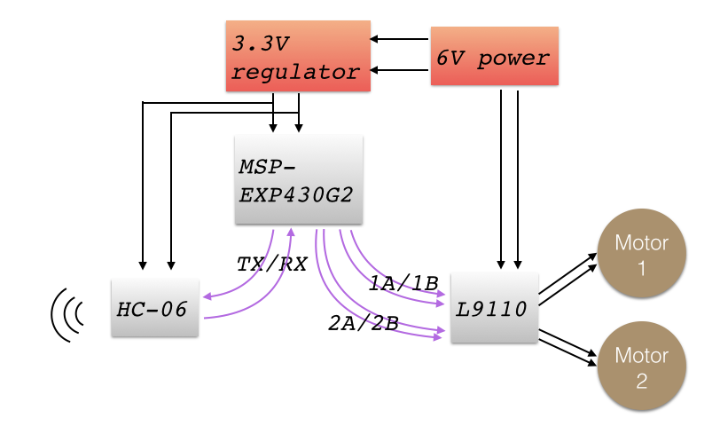
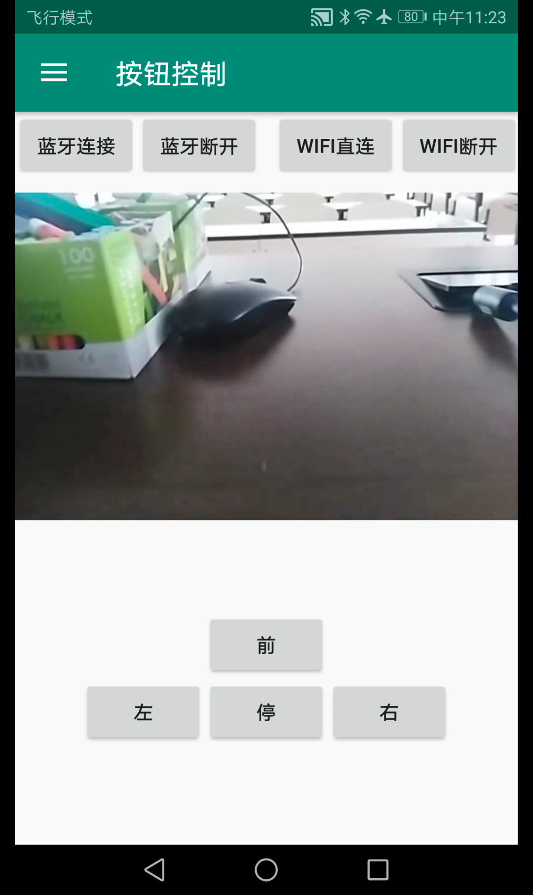
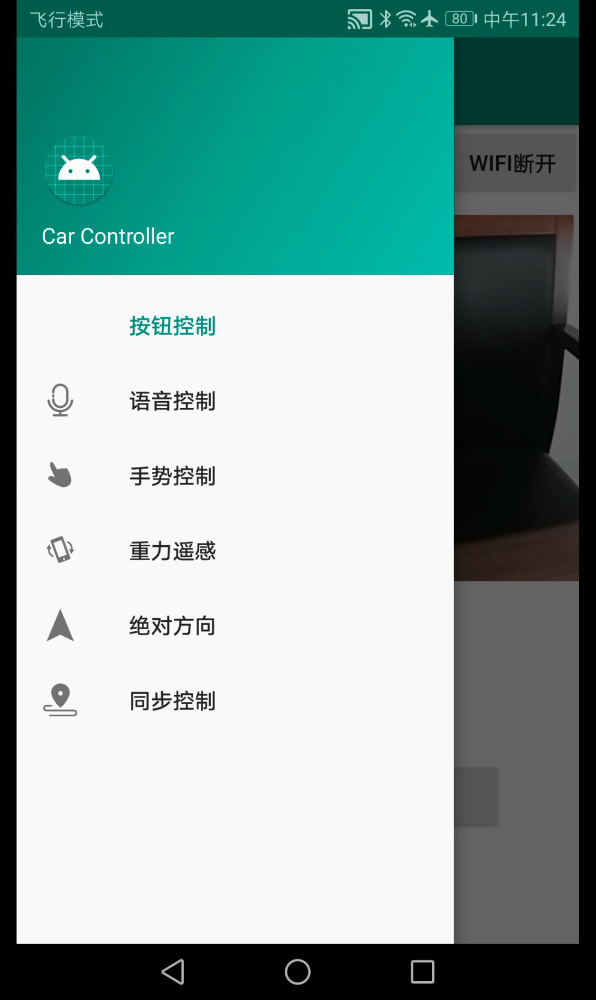
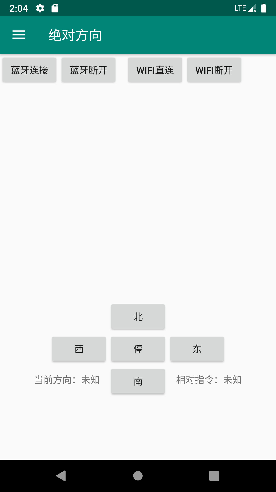

# SJTU-EI312
Car control on Android
## Architecture Overview
Our project consists of three major modules: 

1. CarClient. It is supposed to be installed on a phone riding on the car. Its function includes:
	1. Data transmission (to CarController).
	2. Camera preview.
	3. System sensors.
	4. Auto light.
2. CarController. It is supposed to be installed on another (handheld) phone. Its function includes:
	1. Signal transmission (to car).
	2. Data reception (from CarClient).
	3. Main control.
3. Car. It's downloaded to the microcontroller mounted on the car. It controls the motors according to the received bluetooth signal from CarController.

We will describe the hardware-related part (Car) first, with software part (CarClient & CarController) followed.

## Hardware
The car is powered by a 6-volt battery pack. The main components include:
- Two motors that drives the wheels, one for each side
- A motor driver board (L9110)
- A bluetooth receiver (HC-06)
- A microcontroller (Texas Instruments, MSP-EXP430G2)
A high-level diagram is given below:

    

In effect, the car listens to the command (from bluetooth channel) indefinitely, and acts as the commander says. It doesn't care about *why*. The logic is exceptionally easy: the program sits on a tight loop. If it were ever told to turn left, speed up the right wheel; and vice versa.

There is one technical issue: if the motor starts too `hard`, it will draw a great deal of current from the battery with detriment to the voltage level. This would in turn drive the circuit to an unstable state. Bluetooth module, for example, tends to restart itself during this period.

To prevent this from happenning, we design a `soft start` mechanisim that incrementally picks up speed. The speed increment is not linear, but rather a fine-tuned curve. By this, we strike a balance between the reliability and the response time.

## Software
### Control Panel
In the four figures below, the leftmost one is the navigation bar of our app. The user can navigate to any of our control method through it.

    

#### Basic Control
Second from the left (above) is the basic button control. The signals correspond to the text on the buttons.
#### Speech Control
Second from right (above) is the speech control. Hold the button during speaking and release it after finishing. It recognizes the speech through keywords like "前/直，停，左，右" (forward, stop, left, right) and duration for the control to execute before a stop through "秒" (second(s)), e.g. "前进"，"左转3秒".
#### Gesture Control
The rightmost (above) figure is the gesture control. The user can slide on the screen to generate control signals. The Toast below shows the signal corresponding to the gesture. A mapping from gesture to control signal is *up -> forward, down -> stop, left -> left, right -> right*.
#### Gravity Control
The leftmost (below) figure is the gravity control. The Toast below shows the signal corresponding to the current phone placement. The phone is suppose to be horizontal with screen facing the user, top to the left and relatively upright (in this context, this placement is called base placement) and auto-rotate shut off. The placement-signal mapping is (all comparing to base placement) *move top edge away from user -> forward, base placement -> stop, rotate the phone clockwise -> right, rotate the phone counter-clockwise -> left*
#### Absolute Control
The second from left (below) is the absolute control. The car will move in the direction (north, south, east, west, stop) the user designates. The current direction TextView indicates the direction of the **CarClient** and the relative signal TextView indicates the control signal considering the current direction and the most recent pressed button.
#### Synchronous Control
The second from the right (below) is the basic synchronous control. The car consistently tries to face the direction the controller phone faces. The controller phone is supposed to be horizontal with screen facing the user, top to the left. The TextViews are debug informations. **FORWARD/STOP** button indicates whether the car forwards or stops when its direction is in consistency with that of the controller. **TOGGLE** flips the UI between basic synchronous control and sudoku control.

The rightmost (below) is the sudoku control. The user can draw any valid patterns in the sudoku and the car moves in the same trace. After the car finishes the trajectory, it stays synchronized with the controller. The placement of controller is the same as that of basic synchronous control.

    

## Code Structure
### `DirectionSensor` Module
This module implements `SensorEventListener` and is used in absolute, synchronous control in CarController and main activity in CarClient. In `onSensorChanged` method, first use the values of accelerometer and magnetic field sensors to get the orientation including azimuth, pitch and roll (see detailed information in android [doc](https://developer.android.com/reference/android/hardware/SensorManager.html#getOrientation(float[],%20float[]))), then followed by an abstract method `processDataOrSendSignal` for other specific logic on instantiating. In addition, the class provides `registerSensors` and `unregisterSensor` methods to control the usage of sensors in order to save power when it is not needed.

### `CarClient.WifiClient` Module
It manages the wifi-direct connection with CarController. It starts peer discovery and listens to potential peers nearby. It will accept the connection request sent from the CarController. Then, it consults the IP address of the CarController and sets up a UDP socket for later transmission.

### `CarClient.CameraPreview` Module
It manages the camera on the device. Specifically, it retrieves the preview picture, displays it on screen, transforms it to a UDP packet, and sends it to CarController by calling `WifiClient` module.

### `CarClient.LightSensor` Module
This module implements `SensorEventListener` and is used in main activity in CarClient. In `onSensorChanged` method, it checks the ambient illuminance and whether light is on and call abstract methods `lightOn`/`lightOff` according to the situation. These two methods ought to be abstracted because the `CameraPreview` module occupies the camera all the time and others cannot control the flashlight, thus the logic of turning on/off light has to be implemented by the `CameraPreview` module. Likewise, this class has `registerSensor` and `unregisterSensor` methods.

### `CarClient.MainActivity`
There are four buttons on the layout. One for WiFi Direct connect, one for WiFi Direct disconnect, one for turning on/off direction sensor and one for turning on light sensor. Next to the sensor switch buttons are their status, i.e. on/off along with the values if the sensor is on. Below is the view of the camera.

### `Bluetooth` module
This module manages the bluetooth connection with the Car. It also provides an interface to send command to the Car.

### `CarController.WifiServer` and `CarController.WifiServerThread`
This is the counterpart of `CarClient.WifiClient`. It manages wifi-direct connection with the CarClient. First, it starts peer discovery and sends a connection request if the CarClient is within reach. (It checks the identity by MAC address.) After the CarClient accepts the request, a group is formed and a UDP socket is established. Then, WifiServerThread is put to run indefinitely. It checks if there's incoming packets from CarClient and, if any, unpacks it and dispatches the data by intent.

### `CarController.BasicFragment`
This fragment draws four simple buttons *stop*, *forward*, *left* and *right*. When any of them is pressed, corresponding command is sent to the Car through bluetooth channel.

### `CarController.SpeechFragment` and `CarController.Speech` module
This module invokes the speech recognition serivce embedded in HUAWEI models. It collects the speech data when the user holds a button in the fragment, and uploads the recording to a cloud server when the button is released. The recognition result is pushed back (as an array of strings) and notifies the module by a callback function `onResults`. Then, an intent is sent to inform the fragment where the speech contents wiil be processed.

### `CarController.GestureFragment`
The logic is implemented in a `gesture_detector` which is an instance of `GestureDetector` with `onFling` method overridden. First define a `LEAST_DISLACEMENT`, any gesture whose displacements on both axis smaller than this value is considered invalid. Then compare the absolute displacement on two axis and determine it is a horizontal or a vertical move. At last, determine the sign of displacement on the major axis to figure out the actual gesture.

### `CarController.GravityFragemnt`
Use a `direction_sensor` which is an instance of `DirectionSensor` to get the orientation, in particular pitch and roll of the device, interpret the current placement and send signal accordingly.

### `CarController.AbsoluteFragment`
Use an `onOrientationArrive` which is an instance of `BroadcastReceiver` to get the azimuth of the **CarClient** and compute the angle between the current client direction and user designated direction (north, south, east, west) and send turning signal until the two directions meet.

### `CarController.SynchronousFragment`
Use both a `direction_sensor` and an `onOrientationArrive` to measure the azimuth of **CarController** and **CarClient** respectively and compute the angle between the two devices and send signal to the client to turn. And an attribute named `default_control` holds the default control *0 -> stop, 1 -> forward* when the two devices are synchronized, i.e. in parallel with each other.

### `CarController.TraceDrawer` Module
This is a subclass of `View`. The user is allowed to draw valid patterns on the canvas. After moving hand up from screen, it is considered as finishing drawing and the controller decodes the visited nodes sequence into a control sequence (including the control signal (forward, stop, left, right), moving distance (if control signal is forward) and turning degrees (if control signal is left/right)) and send it to the client. The plotting scale is controlled by a constant attribute `UNIT_DISTANCE`. 
 